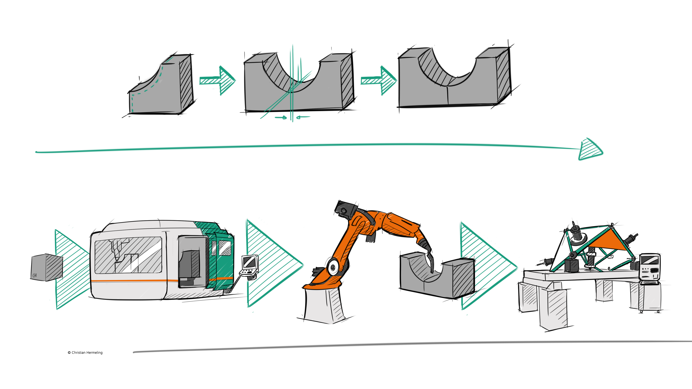
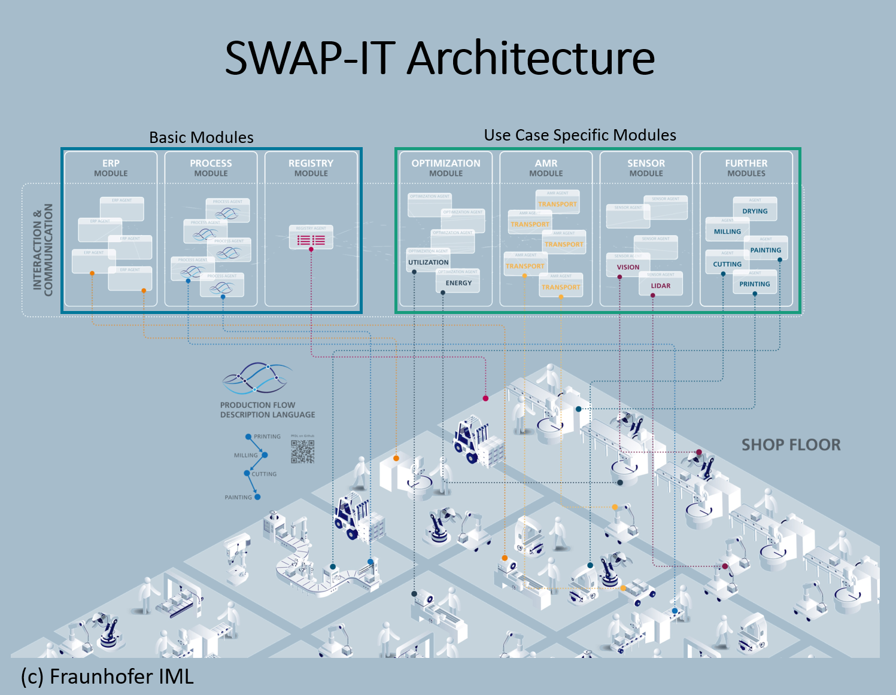

# SWAP-IT Use Case: Large Scale Workpieces
As part of the Fraunhofer lighthouse project [SWAP](https://www.fraunhofer.de/de/forschung/fraunhofer-initiativen/fraunhofer-leitprojekte/swap.html) within the _Large Scale Workpieces_ use case the Fraunhofer IWU developed a solution for the production of large-volume, metallic components on small machine tools. A prototypical implementation was successfully implemented and [demonstrated](https://www.produktion.fraunhofer.de/de/forschung-im-verbund/formate/leitprojekte/swap/grossbauteilfertigung.html).

    
    Large scale workpieces are segmented for manufacturing on standard machine tools

## Success-Story: Cyber-Physical Factory
A second focus of the Fraunhofer IWU in this project was the connection of various machines and systems to the new production architecture. This approach is based on the skill-based control framework (https://www.frontiersin.org/journals/robotics-and-ai/articles/10.3389/frobt.2022.1014476/full), which enables the standardized provision of production technology services, even for different control system manufacturers.
Specific challenges were identified and addressed during the development stage. The solution approach for overcoming these difficulties is demonstrated in the success story _Cyber-Physical Factory_ illustrated by a complex hybrid component.
The process is first implemented and tested with a simulation model and later transfered to the real production systems. During the first stage the skill-based control framework is utilized to simulate the production assets. Finally the framework is used to call provided services of real assets.

    
    The IWU test field in Dresden Gittersee as a cyber-physical factory

## SWAP-IT Architecture
The SWAP-IT architecture (https://ieeexplore.ieee.org/document/9926665) was also developed as part of the Fraunhofer lighthouse project. This new technological concept makes it possible to implement the production of tomorrow by transforming rigid production
environments with individual processing stations into flexible and dynamic production environments. The core of this
innovation is a modular cyber-physical production system (CPPS) that efficiently integrates centralized and
decentralized elements as a network of software and mechanical components. The modules are specially designed
to adapt seamlessly to different production environments and can be further developed with minimal effort.

    
    The SWAP-IT architecture introduces a modular, scalable and lightweight architecture utilizing simplified semantic information models.

## Documentation
For a detailed explanation of the success story and fascinating tutorials on how to implement the architecture, visit our online documentation [Cyber-Physical Factory](https://swap-it.github.io/cyber-physical-factory/).

## License

This project uses the *asyncua* library, which is licensed under the GNU Lesser General Public License v3.0 (LGPL-3.0). A copy of the LGPL-3.0 license is included in the LICENSE file.

For more details, see the [LGPL-3.0 license](https://www.gnu.org/licenses/lgpl-3.0.en.html).