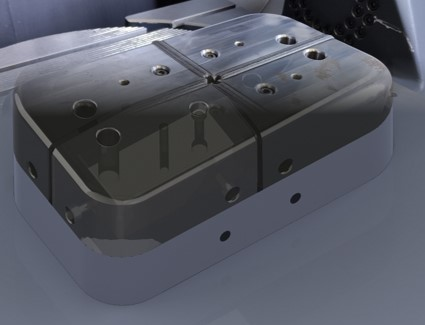

Introduction to Use Case
########################

Overview
********
Large scale workpieces are highly challenging in manufacturing processes. Typically, the size and costs of machines required for processing such workpieces increase with the their size. To overcome this drawback, a segmentation approach can be employed, where large workpieces are divided into smaller segments as shown in the following figure:

   Segmented workpiece

These segmented workpieces can then be processed by smaller and more affordable machines as demonstrated in `Large scale workpieces by segmentation <https://www.produktion.fraunhofer.de/de/forschung-im-verbund/formate/leitprojekte/swap/grossbauteilfertigung.html>`_. However, a new challenge arises when the segmented components need to be distributed to the individual processing stations. To tackle this challenge, a *Cyber-Physical Factory*, which is highly digitized and powered by software tools such as the `SWAP-IT architecture <https://ieeexplore.ieee.org/document/9926665>`_, is needed. Modern production layouts, such as matrix systems, together with the `SWAP-IT architecture <https://ieeexplore.ieee.org/document/9926665>`_, form an adjustable production infrastructure that enables the efficient production of both small and large batch sizes. This is achieved by means of production planning and control that flexibly allocates these modules. Thanks to segmentation and intelligent distribution of production workloads it also fascilitates to produce large components in small systems.

Success story Cyber-Physical Factory
************************************
Methodical approach
===================
.. _methodology:

To establish the `SWAP-IT architecture <https://ieeexplore.ieee.org/document/9926665>`_ to a brownfield and to promote a conventional factory one step further towards a cyber-physical factory, the following process oriented methodology is recommended [1]_:

.. raw:: html
   :file: ../fig/methodology.drawio.html
.. raw:: html

   

      Methodology for the transformation of a brownfield shop floor into a cyber-physical factory
   

     

Steps 2 and 3 are not obligatory and with more experience in the setup procedures, these simulation steps might be skipped.

Each of these steps makes use of specific components of the `SWAP-IT architecture <https://ieeexplore.ieee.org/document/9926665>`_. Since the goal is to apply the architecture to a brownfield application, some additional components are needed. These components and their integration into the overall `SWAP-IT architecture <https://ieeexplore.ieee.org/document/9926665>`_ are discussed in section :doc:`Architecture <03_architecture>`, while the presented methodical approach is discussed below in a general way and in :doc:`How-to-Guides <05_how_to_guides>` in a usecase specific way.

1. Model the process
--------------------
The entryproint for a succsessfull setup of the `SWAP-IT architecture <https://ieeexplore.ieee.org/document/9926665>`_ is the process modeling. With respect to the architectural setup, the goal is to check if the process works like expected. For the declaration of processes the `Production Flow Description Language (PFDL) <https://github.com/iml130/pfdl>`_ is used. With the help of the PFDL customized products and their production steps can be described. The user benefits from a domain specific language. Process experts which are not familiar to programming languages are enabled to automate processes. The output of this step is the PFDL file describing the process.

2. Create a simulation environment for the SWAP-IT architecture
---------------------------------------------------------------
The simulation environment should provide a virtual representation of the machines involved in the modeled process. A Visual Components model is used to represent the machines and visualize the execution of the individual process steps. The capabilities and skills provided by the real assets have to be made available in this simulation model. In the *Cyber-Physical Factory* success story this is accomplished by means of Docker containers that represent the behavior of each individual machine. These Docker containers are connected via OPC-UA to the Visual Components simulation model. How an emulation of real assets and their control systems can be achived by means of the `Skill-based control framework <https://www.frontiersin.org/journals/robotics-and-ai/articles/10.3389/frobt.2022.1014476/full>`_  is shown in :doc:`Architecture <03_architecture>`.

3. Evaluate the architectural setup with respect to the simulation
------------------------------------------------------------------
For the evaluation of the setup the common `SWAP-IT Software Modules <https://swap-it.github.io/demo-scenario/swpa_it_sw.html>`_ (*Device Registry*, *PFDL Scheduler*, *Execution Engine*, ...) are used (for an overview of all modules comprising the SWAP-IT architecture see `Demonstration Scenario <https://swap-it.github.io/demo-scenario#swap-it-software>`_) in conjunction with the simulated machines. The interface between the `SWAP-IT architecture <https://ieeexplore.ieee.org/document/9926665>`_ and the simulated machines is an `open62541 <https://github.com/FraunhoferIOSB/swap-it-open62541-server-template>`_-based OPC-UA module server. This server implements the communication with the simulated and real systems and facilitates access to the skills and services provided by these systems. The *Execution Engine* reads the `PFDL <https://github.com/iml130/pfdl>`_ file that was created in the first step and triggers the process accordingly.

4. Connect the SWAP-IT architecture to the real environment
-----------------------------------------------------------
The `open62541 <https://github.com/FraunhoferIOSB/swap-it-open62541-server-template>`_-based OPC-UA module server in conjunction with the `Skill-based control framework <https://www.frontiersin.org/journals/robotics-and-ai/articles/10.3389/frobt.2022.1014476/full>`_ allows for a quick and easy toggling of the connection between the simulation model and the real shop floor. This is facilitated by installing the Skill-based control framework on the real assets. Because the Docker containers reproduce this framework in the same way, the SWAP-IT architecture does not even notice the difference and the common `SWAP-IT Software Modules <https://swap-it.github.io/demo-scenario/swpa_it_sw.html>`_ do not have to be modified. Only the endpoint in the module server is adapted.

5. Evaluate the architectural setup with respect to the real assets and modeled process
---------------------------------------------------------------------------------------
As the common `SWAP-IT Software Modules <https://swap-it.github.io/demo-scenario/swpa_it_sw.html>`_ can be used in the way same as in the simulation, the process for executing the real process is identical to the simulation mode. Therefore the `PFDL <https://github.com/iml130/pfdl>`_ generated in the process modeling is parsed and the module servers are orchestrated accordingly.

Application Scenario
====================

The application scenario demonstrates the basic functionalities provided by the `SWAP-IT Software Modules <https://swap-it.github.io/demo-scenario/swpa_it_sw.html>`_: The orchestration and scheduling of a simple sequential production process with different machines. This process illustrates how such a system can benefit from the `SWAP-IT architecture <https://ieeexplore.ieee.org/document/9926665>`_.

The general process is a sequence of different stand alone manufacturing processes. The goal is to produce a transport housing for a custom measuring device to provide protection for transport processes. The transport housing is equipped with three single measuring device parts:

.. figure:: ../fig/application_workpiece.PNG
   :align: center

   Application scenario workpiece equipped with measuring device parts

The following figure illustrates the sequential flow of the individual steps, that define the overall process:

.. raw:: html
   :file: ../fig/cpps_flow.drawio.html 
.. raw:: html

   

      Process sequence for the modeled application scenario
   

     

The starting point is a 3D printing process where the corpus of the system is built. This corpus is machined by a milling machine afterwards, to provide negative contures for the measuring device. The machining process itself is executed by a milling machine but the operation of the milling machine is carried out by the `Robo Operator <https://www.iwu.fraunhofer.de/de/presse-und-medien/presseinformationen/PM-2020-Robotik-sicher-Produktivitaet-trotz-Fachkraeftemangels.html>`_, a mobile robot cell optimized for this purpose. The manufactured case is then transported to a coordinate measuring machine to check if main geometric properties are within tolerances. Afterwards, an assembly cell -- a robot cell with two robots -- combines the measuring device and the transport housing. To check if the device is properly inserted into the transport housing, an image is captured from the housing and saved for trackability.

The application scenario is implemented on the test field in Dresden. The following picture provides an overview of this test field:

.. figure:: ../fig/VF_real.JPG
   :align: center

   Test field in Dresden with the machines needed to demonstrate the use case

As outlined in  `Methodical Approach <#methodology>`_, there are 5 steps necessary to implement the `SWAP-IT Software Modules <https://swap-it.github.io/demo-scenario/swpa_it_sw.html>`_ for this process.

1. Model the process
--------------------
.. _applicationscenariolink:

The outlined process is modeled using the `Production Flow Description Language (PFDL) <https://github.com/iml130/pfdl>`_. Visualizing the process as a petri net (graphical presentation of the corresponding PFDL program) leads to the following image:

.. figure:: ../fig/use_case_petrinet.PNG
   :align: center

   Petri Net corresponding to PFDL file for modeled application scenario process

The outer box represents the overall production task. Each subbox corresponds to one individual process step, while each step comprises one specific service (printing, machining, measuring and assembling). This is only a static view. When integrated into the `SWAP-IT Dashboard <https://github.com/iml130/swap-it-dashboard>`_  it is used to dynamically track the progress of the overall process by transitioning the token from one step to the next. The corresponding PFDL file can be found in `Application Scenario PFDL file <#pfdllink>`_. 
The process is described here independently of any specific machines. The individual process steps are assigned by the `Execution Engine <https://github.com/FraunhoferIOSB/swap-it-execution-engine>`_ at runtime.

2. Create a simulation environment
----------------------------------
A simulation environment was modeled using `Visual Components <https://www.visualcomponents.com/>`_. Here for each real asset in the application scenario a virtual counterpart and one OPC-UA server was set up to connect the virtual representation of this asset to the SWAP-IT architecture. As a complement to the Visual Components OPC-UA servers, skill servers are emulated on the SWAP-IT architecture side, which map the behavior of the real machines exactly from the architecture's perspective. For each asset a set of specific services was modeled. In this way, it is possible to visualize the execution of the process sequence, estimate cycle times and simulate the behaviour of the machines in the event of faults such as machine failure or occupancy.

3. Evaluate the architectural setup with respect to the simulation
------------------------------------------------------------------

To evaluate the process, that was modeled as a `PFDL <#pfdllink>`_ file, all the SWAP-IT software modules were launched as docker containers. The PFDL file is being parsed and the process is started. By means of the Visual Components model all the defined and simulated services of each asset are executed and visualised in the defined sequence by means of the OPC-UA connections to the emulated skill servers. Once a service is finished a *complete* command is returned to the `Execution Engine <https://github.com/FraunhoferIOSB/swap-it-execution-engine>`_ so as to start the next service.
The video below demonstrates the simulated process execution.

.. video:: ../videos/VC_overall_process.mp4
   :width: 700
.. raw:: html

   

      Simulated process execution in Visual Components
   

     

4. Connect the SWAP-IT architecture to the real environment
-----------------------------------------------------------
To evaluate the implemented SWAP-IT architecture real assets from the IWU test field in Dresden were utilized. Not all of the above depicted machines in the test field are involved in the modeled process. Only the assets marked in green in the following figure are integral parts of the application scenario:

.. figure:: ../fig/VF_Schema_Text.PNG
   :align: center

   Schematic representation of the Fraunhofer IWU test field in Dresden. The machines involved in the process execution are marked in green.

In particular the following machines are involved:

.. list-table:: Overview of machines involved in application scenario process
   :widths: 33 33 33

   * - SeamHex
     - RoboOperator
     - MAHO
   * - .. image:: ../fig/SeamHex_real.JPG
     - .. image:: ../fig/RoboOperator_real.JPG
     - .. image:: ../fig/MAHO_real.JPG
   * - Coordinate measuring machine
     - Dual arm robot cell
     - Automated guided vehicle
   * - .. image:: ../fig/CMM_real.PNG
     - .. image:: ../fig/BioiC_real.JPG
     - .. image:: ../fig/AGV_real.PNG

5. Evaluate the architectural setup with repect to the real assets
------------------------------------------------------------------

To execute the process sequence modeled in step 1, only the connection of the `Execution Engine <https://github.com/FraunhoferIOSB/swap-it-execution-engine>`_ to the emulated skill servers has to be replaced by a connection to the real assets. All the other SWAP-IT software modules remain unchanged and don't even notice the modification. The process sequence is executed all the same, only by the real machines instead of the simulation model.

The following video demonstrates the execution in the test field in Dresden.

.. video:: ../videos/cps_trailer.mp4
   :width: 700
.. raw:: html

   

      Real process execution in the test field in Dresden.
   

     

Implementation of transport services between the stations
=========================================================

Each service can be composed of several skills. The following table lists the skills for each service of the application scenario process.

.. list-table:: Overview of skills comprising the single services
   :widths: 25 25 25 25
   :header-rows: 1

   * - PrintingService
     - MillingService
     - ScanningService
     - AssemblingService
   * - SeamHex.StartNcProgramSkill
     - AGV.ROPlaceSkill
     - AGV.CMMPlaceSkill
     - AGV.BioiCPlaceSkill
   * - AGV.SeamHexPickSkill
     - VisionRO.DetectBarcodeSkill
     - VisionCMM.DetectBarcodeSkill
     - VisionBioiC.DetectBarcodeSkill
   * - 
     - RO.StartConfigurationSkill
     - CMM.StartMeasurementSkill
     - BioiC.DBBPickAndPlaceSkill
   * - 
     - AGV.ROPickSkill
     - AGV.CMMPickSkill
     - AGV.BioiCPickSkill

The table reveals that the pick and place transport skills are implicit parts of the services. This is based on the fact that the subsequent station is not yet known at the time of the execution of the current process step as a result of the machine assignment at runtime. For this reason, each process step begins with the delivery of the workpiece already loaded on the AGV and ends when the workpiece is picked up again from the AGV after the process step has been completed.

Assignment of the individual process steps to specific machines
===============================================================

One of the significant benefits of abstract process modeling with the PFDL and its execution by the SWAP-IT architecture is the assignment of each individual process step to a specific asset at runtime. The `Assignment Agent <https://fraunhoferiosb.github.io/swap-it-execution-engine/ResourceAssignment.html>`_ takes process-specific requirements into account when selecting a suitable asset. This method is demonstrated in the application scenario using the *MillingService*. In addition to the *Maho* and the *RoboOperator*, two further milling machines were added to the Visual Components simulation model: a machine tool (*DMU*) and a milling robot (*Comau*). All three manufacturing stations were described in terms of production *costs* and maximum achievable *milling precision*.

The practical implementation of this resource allocation is explained in detail in section :doc:`Advanced Tutorial <04_3_advanced>`.

Appendix
********
Application Scenario PFDL file
==============================
.. _pfdllink:

The PFDL file belonging to the petri net shown in `Application Scenario <#applicationscenariolink>`_ looks like this:

.. literalinclude:: ../pfdl/cps_demo.pfdl
.. raw:: html

   

      PFDL file representing the application scenario process
   

     

.. [1] `Adapted from "Challanges in Enterprise Data Protection". DataSunrise <https://www.datasunrise.com/de/wissenszentrum/unternehmensdatenschutzdienste/#:~:text=Herausforderungen%20im%20Bereich%20Enterprise%20Data%20Protection>`_

