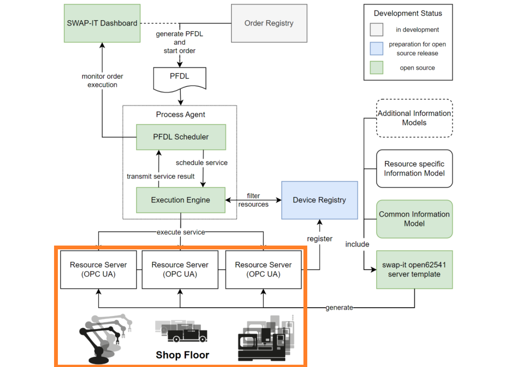

Architecture
############
Interface between SWAP-IT architecture and Shop Floor
*****************************************************

The architectural setup of the success story *Cyber-Physical Factory* is based on the `SWAP-IT Software Modules <https://swap-it.github.io/demo-scenario/swpa_it_sw.html>`_.
This section describes the approach to developing a universal interface between the SWAP-IT architecture and the shop floor.

As depicted in the figure below, the application consists of a set of loosely coupled software components. The figure depicts all software components that are currently available as open source projects, or will be published as open source projects within 2024. The development status and the interaction of these components are also provided.

   SWAP-IT software modules and there interaction. Marked in orange is the interface of the SWAP-IT architecture to the shop floor assets.

The orange box illustrates the interface of the SWAP-IT architecture to the shop floor assets. Each resource on a shop floor is defined as a SWAP-IT asset (*Use-Case Specific Modules*). Such assets can be defined by utilizing the SWAP-IT `Common Information Model <https://github.com/FraunhoferIOSB/swap-it-common-information-model>`_. 
The challenge for many shop floors is that new machines and systems cannot always be easily integrated into the SWAP-IT architecture as the control system infrastructure usually is very heterogeneous. In addition, the set-up of a resource server is not a simple task.

Skill-based control focused approach to provide unified interface
*****************************************************************
The work of the Fraunhofer IWU focused on the development of an unified interface between the SWAP-IT architecture and the heterogeneous control system infrastructure. The following figure depicts how the skill-based control framework is used as an interface between the SWAP-IT architecture and both virtual and real assets.

.. raw:: html
   :file: ../fig/architecture.drawio.html    
.. raw:: html

   

      Provision of unified interface to heterogeneous control systems by application of skill-based control framework (SBC).
   

     

The interface between the shop floor and the SWAP-IT architecture shown above is a generic universal machine connector. It comprises two separate elements. On the shop floor side, it consists of assets (robots, machine tools, AGVs, etc.) that are provided with the skill-based control framework. The framework provides certain skills via an OPC-UA interface. On the SWAP-IT side, the connector consists of a precompiled resource server based on the Common Information Model, which is provided as a Python package. Using a JSON file, an OPC-UA server compatible with the SWAP-IT architecture can easily be set up in a Python script. Callback functions can be defined for these servers, in which the skills of the assets are called via the SBC framework.

All assets are modularized, followed by assigning the functions of the assets to the modules as parameterizable skills.
Object-oriented programming ensures uniform states and interfaces. In the SBC, a superclass as a template for an unified asset module is defined. New asset modules are thus created by inheritance of the template module. This approach enables consistent handling, monitoring, state control and error management of all the different modules in an asset. The communication between the modules of different controllers is realized via various manufacturer- and programming language-independent interfaces, such as OPC-UA. To provide the asset functions, such as *move* of a robot or *close* of a gripper, parameterizable skills for modules are defined.  In programming, the bottom-up approach can be used to implement the available functions for
each asset as skills in the module control. The control programmer should implement not only the asset functions that are necessary for the overall automation solution, but also the functions that the asset can perform independently of other assets. This guarantees the flexible usability of all functionalities of the assets. 

Another important aspect is the possibility to parameterize the skills to adapt the individual asset functions to different process tasks. For example, the target position can be specified as a parameter for a robot movement to enable configurability by the operator. Due to the modularization, an orchestration system can communicate with all available module skills using different communication interfaces like both vendor-specific and vendor-independent ones. Complex process sequences can be configured by parameterizing and combining skills into reusable steps, whereby the operator can flexibly change individual parameters of skills or entire steps at any time. The *Execution Engine* functions as such an orchestration system.

The SBC allows all available services and skills of a real system to be queried via OPC UA. A Python module is generated for each asset, which contains the services and skills as methods of an asset object that also implements communication with the respective asset. To connect the SBC to the SWAP-IT architecture a python wrapper is built around the `open62541 server template <https://github.com/FraunhoferIOSB/swap-it-open62541-server-template>`_, which allows the execution of python scripts by the *Execution Engine*.
