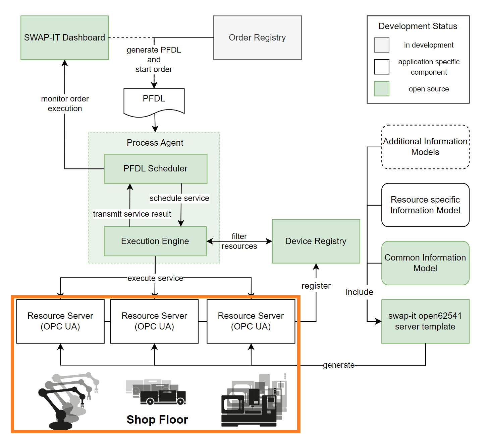

Architecture
############
Interface between SWAP-IT architecture and Shop Floor
*****************************************************

The architectural setup of the success story *Cyber-Physical Factory* is based on the `SWAP-IT Software Modules <https://swap-it.github.io/demo-scenario/swpa_it_sw.html>`_.
This section describes the approach taken to develope an universal interface between the SWAP-IT architecture and the shop floor.

As depicted in the figure below, the SWAP-IT architecture consists of a set of loosely coupled software components. The figure depicts all software components that are currently available as open source projects or are still in development. Also, application specific components are included. The development status and the interaction of these components are also provided.

   SWAP-IT software modules and their interaction. Marked in orange is the interface of the SWAP-IT architecture to the shop floor assets.

The orange box illustrates the interface of the SWAP-IT architecture to the shop floor assets. Each resource on a shop floor is defined as a SWAP-IT asset (*Use-Case Specific Modules*). Such assets can be defined by utilizing the SWAP-IT `Common Information Model <https://github.com/FraunhoferIOSB/swap-it-common-information-model>`_. 
The challenge for many shop floors is that new machines and systems cannot always be easily integrated into the SWAP-IT architecture as the control system infrastructure usually is very heterogeneous. In addition, the set-up of a resource server is not a simple task.

Skill-based control focused approach to provide unified interface
*****************************************************************
The work of the Fraunhofer IWU focused on the development of an unified interface between the SWAP-IT architecture and the heterogeneous control system infrastructure. The following figure depicts how the skill-based control framework (SBC) is used as an interface between the SWAP-IT architecture and both virtual and real assets.

.. raw:: html
   :file: ../fig/architecture.drawio.html    
.. raw:: html

   

      Provision of unified interface to heterogeneous control systems by application of SBC.
   

     

The interface between the shop floor and the SWAP-IT architecture shown above is a generic universal machine connector. It comprises two separate elements. On the shop floor side, it consists of assets (robots, machine tools, AGVs, etc.) that are provided with the SBC. The framework provides certain skills via an OPC-UA interface. On the SWAP-IT side, the connector consists of a precompiled resource server based on the Common Information Model, which is provided as a Python package. Using a JSON file, an OPC-UA server compatible with the SWAP-IT architecture can easily be set up in a Python script. Callback functions can be defined for these servers, in which the skills of the assets are called via the SBC framework.
The SBC ensures that the real and virtual assets are identical from the perspective of the swap-it architecture.

The following figure illustrates how virtual and real assets can be connected to the SWAP-IT architecture via the SBC.

.. raw:: html
   :file: ../fig/architecture_virtual_real.drawio.html    
.. raw:: html

   

      Virtual and real assets can be connected to the SWAP-IT architecture via the SBC.
   

     

By configuring the module server appropriately, a connection can be established to either the virtual or the real assets. This configuration is realized by specifying the endpoint for the communication of the module server. Either a real ip address including all login information is provided or an internal docker compose network address is specified. In the virtual case, a simulation environment can be connected to the skill server either to just visualize the process or, for example, to take simulated system behavior into account.

The SBC allows all available services and skills of a real system to be queried via OPC UA. A Python module is generated for each asset, which contains the services and skills as methods of an asset object that also implements communication with the respective asset. To connect the SBC to the SWAP-IT architecture a python wrapper is built around the `open62541 server template <https://github.com/FraunhoferIOSB/swap-it-open62541-server-template>`_, which allows the execution of python scripts by the *Execution Engine*.
