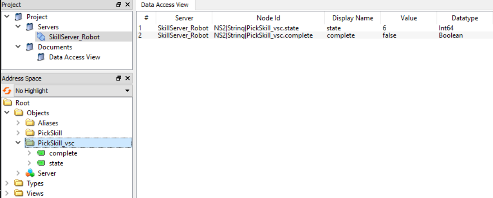
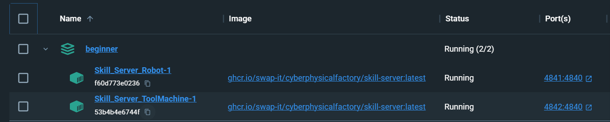

Beginner
########

This tutorial demonstrates how to set up skill servers using the skill-based control framework and how to invoke and execute skills using two different methods. This ensures that the assets on the shop floor side are prepared for the machine connector.

Users who are already familiar with the skill-based control framework can skip directly to the next tutorial.

The Python packages for the skill-based control framework that are required to run this tutorial and detailed instructions for installing and deploying the framework can be found in the following repositories:

    - `SBC Statemachine Project <https://github.com/cognitive-production/skillbasedcontrol-statemachine>`_ (class implementing the Module Type Package (MTP) service statemachine and all necessary data structures)
    - `SBC Server Project <https://github.com/cognitive-production/skillbasedcontrol-server>`_ (classes for implementing skills in python and provide them via an opc ua server)
    - `SBC Communication Project <https://github.com/cognitive-production/skillbasedcontrol-communication>`_ (class for communicating with skills implemented in assets with a SkillBasedControlFramework)

Please navigate to the *01_beginner* folder of the repository to start the beginner tutorial.

Start a single skill server
***************************

To configure a skill, based on a JSON file, and start a skill server providing this skill, the following lines of code are necessary:

.. code-block:: python
    :linenos:

    import glob
    import os
    import argparse
    import json

    from sbc_statemachine.skilldatahandle import (
        SkillDataHandle,
    )
    from sbc_server.skillimplementations import (
        ExternalExecuteSkill,
    )
    from sbc_server.skillserver_opcua_vc import SkillServer_OPCUA_VC
    from sbc_server.runskillserverhelper import run_skillserver

    # Specify the path to the json files subdirectory
    json_directory_path = "skills/"
    # empty list for storage of skills
    skills = []

    # 1. Implement custom skill class inheriting from ExternalExecuteSkill
    class CustomSkill(ExternalExecuteSkill):
        def __init__(self, json_file) -> None:
            data = SkillDataHandle()
            data.set_fromJsonFile(json_file, toSkillDataDefault=True)
            data.reset_SkillDataCommand()
            super().__init__(data=data)

    def server(machine_name, port):
        # 2. Create object of custom skill class
        # Use glob to find all JSON files in the subdirectory
        json_files = glob.glob(os.path.join(json_directory_path, "*.json"))
        for json_file in json_files:
            if machine_name.lower() in json_file.lower():
                with open(json_file, "r") as file:
                    data = json.load(file)
                    skill_name = data.get("strName")
                skills.append(
                    CustomSkill(json_directory_path + skill_name + machine_name + ".json")
                )

        # 3. create skillserver object and inject custom skill objects
        skill_server_OPCUA = SkillServer_OPCUA_VC(
            skills,
            skill_cycletime=0.1,
            server_cycletime=0.5,
            port=port,
        )
        # 4. start skillserver, for example using run_skillserver from runskillserverhelper
        run_skillserver(skill_server_OPCUA)

    if __name__ == "__main__":
        parser = argparse.ArgumentParser()
        parser.add_argument(
            "--machine", default="TestMachine", help="Provide name of machine"
        )
        parser.add_argument("--port", default=4840, help="Provide port of server")
        args = parser.parse_args()
        server(args.machine, args.port)

.. list-table:: Explanation of code
   :widths: 10 70
   :header-rows: 1

   * - line number
     - meaning
   * - 16
     - defines the file path for the JSON files, that specifies the skills
   * - 22-27
     - definition of skill class
   * - 30-41
     - matching of JSON filenames in *skills* folder with given *machine_name*
   * - 44-49
     - configuration of skill server with given *port*
   * - 51
     - start of skill server

There are two methods to implement this example in the context of this tutorial. The first option is to install the three Python packages listed above according to the instructions in the corresponding repositories. The server can then be started via the command line interface with the following command:

.. code-block:: bash

    python -m start_skill_server --machine "Robot" --port 4841

The *--machine* option is used to find the corresponding JSON file in the “skills” folder. The *--port* option specifies the port of the localhost at which the server will be available.

The JSON file defining the *PickSkill* for the *Robot* looks like this:

.. code-block:: JSON
    :linenos:

    {
        "strName": "PickSkill",
        "strType": "Pick",
        "strGroup": "",
        "strDescription": "Skill to pick a part",
        "iParameterCount": 3,
        "astParameters": [
            {
                "strName": "x",
                "strValue": "0.0",
                "strUnit": "",
                "strDescr": ""
            },
            {
                "strName": "y",
                "strValue": "0.0",
                "strUnit": "",
                "strDescr": ""
            },
            {
                "strName": "z",
                "strValue": "0.0",
                "strUnit": "",
                "strDescr": ""
            }
        ]
    }
   
The JSON file defines the skill name and the skill parameters.

The second option is to start the server using a YAML file and docker compose. You can start a docker container by executing the following bash command:

.. code-block:: bash

    docker compose -f docker-compose-start-1-skill-server.yml -p beginner up -d

The file *docker-compose-start-skill-server.yml* looks like this:

.. code-block:: yaml
    :linenos:

    Skill_Server_Robot:
        hostname: robot
        image: ghcr.io/swap-it/cyberphysicalfactory/skill-server:latest
        ports:
        - "4841:4840"
        volumes:
        - ./skills:/usr/skill_server/skills
        command: ["start_skill_server.py",--machine, Robot]

.. list-table:: Explanation of code
   :widths: 10 70
   :header-rows: 1

   * - line number
     - meaning
   * - 4-5
     - definition of port at which the skill server is available
   * - 6-7
     - *skills* folder is mounted to the container
   * - 8
     - execution of *start_skill_server.py* module with *machine_name* *Robot*

You can use an OPC-UA client tool like *UaExpert* to check the state of the skill server. For our example it looks like this:

.. figure:: ../fig/uaexpert_1server_idle_beginner.PNG
   :align: center

   *UaExpert* view on *Robot* skill server. The server is in state (4) *idle* waiting for execution.

The *PickSkill* is in state (4) *idle*. With the following Python code, the *PickSkill* of the *Robot* skill server is executed, transfering the server state form *idle* (4) to *execute* (6):

.. code-block:: python
    :linenos:

    from sbc_communication.assetskillshandle import AssetSkillsHandle
    from sbc_communication.assetskillscommunication_factory import (
        createSkillCom_Python_Asyncua,
    )

    skillComm = createSkillCom_Python_Asyncua(
        opc_url="opc.tcp://127.0.0.1:4841",
    )

    # create asset skills handle, inject the skill communication object
    assetHandle = AssetSkillsHandle(
        assetName="LocalPythonAsset", assetSkillCommunication=skillComm
    )

    availableSkills = assetHandle.read_availableSkills()

    skillName = "PickSkill"

    # read actual skilldata (SkillData) as reference
    skilldata = assetHandle.read_stSkillData(skillName)
    # reset skillDataCommand
    skilldata.reset_SkillDataCommand()

    # set new skill parameters in stSkillDataCommand, you have to know about each parameter
    skilldata.stSkillDataCommand.astParameters[0].strValue = str(0)
    skilldata.stSkillDataCommand.astParameters[1].strValue = str(0)
    skilldata.stSkillDataCommand.astParameters[2].strValue = ""

    # execute skill, skill parameters from skilldata will be written inside
    result = assetHandle.skillExecHandler.executeSkill(skillName)

.. list-table:: Explanation of code
   :widths: 10 70
   :header-rows: 1

   * - line number
     - meaning
   * - 25-27
     - setting of skill parameters
   * - 30
     - execution of skill, transfering the skill to state (6) *execute*

   *UaExpert* view on *Robot* skill server. The server is in state (6) *execute*.

Once the *complete* flag is set to *True* the skill state is transfered to state (17) *completed*.

.. figure:: ../fig/uaexpert_1server_completed_beginner.PNG
   :align: center

   *UaExpert* view on *Robot* skill server. The server is in state (17) *completed*.

Start multiple skill servers
****************************

As soon as multiple skill servers are to be started, the first methode demonstrated above becomes cumbersome. With the second method it is much easier. The following simple example will illustrate this.
In addition to the *Robot* skill server, we will now start a skill server for a *ToolMachine* by running the following command in a terminal:

.. code-block:: bash

    docker compose -f docker-compose-start-2-skill-servers.yml -p beginner up -d

The YAML file looks like this:

.. code-block:: yaml
    :linenos:

    services:

    Skill_Server_Robot:
        hostname: robot
        image: ghcr.io/swap-it/cyberphysicalfactory/skill-server:latest
        ports:
        - "4841:4840"
        volumes:
        - ./skills:/usr/skill_server/skills
        command: ["start_skill_server.py",--machine, Robot]

    Skill_Server_ToolMachine:
        hostname: toolmachine
        image: ghcr.io/swap-it/cyberphysicalfactory/skill-server:latest
        ports:
        - "4842:4840"
        volumes:
        - ./skills:/usr/skill_server/skills
        command: ["start_skill_server.py",--machine, ToolMachine]

This way it is very easy to scale an application by simply copying, pasting and customizing the same lines of code in the YAML file.

In *Docker Desktop* it should look like this:

   *Docker Desktop* view on *Robot* and *ToolMachine* skill servers.

In *Docker Desktop* the user can inspect and interact with the containers easily.

The user is in a position now to define skills, configure and start skill servers and call skills either by executing Python scripts or by starting docker compose projects.
In the next tutorial, the user will learn how to set up a *module server* to connect the skill server to the SWAP-IT software architecture.