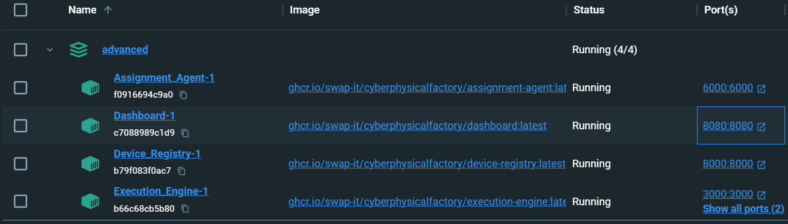
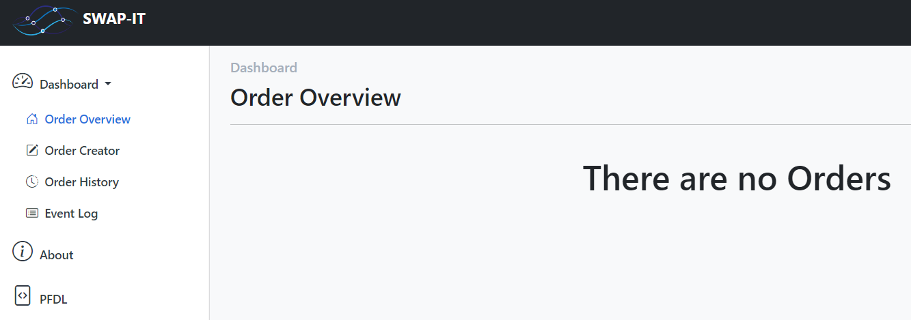
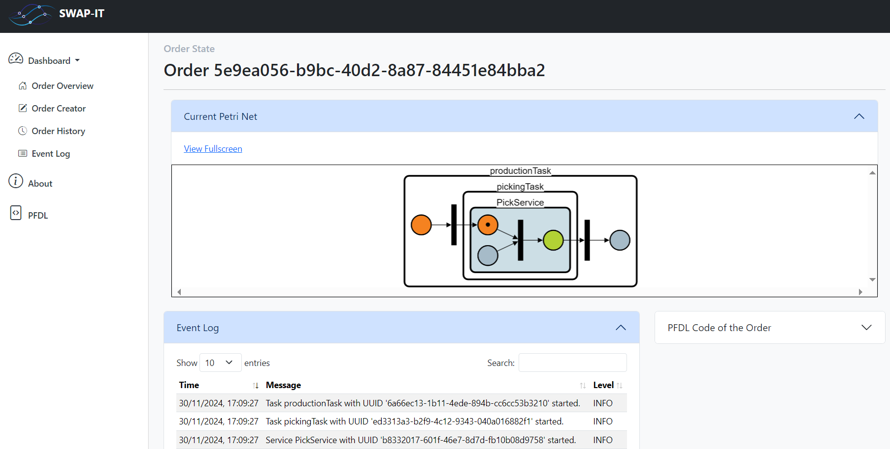
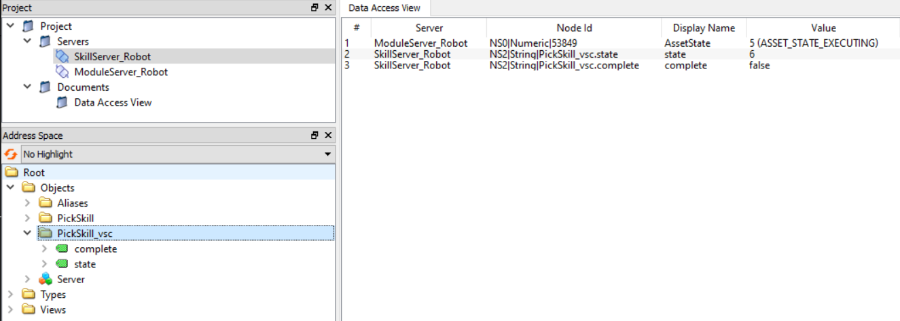
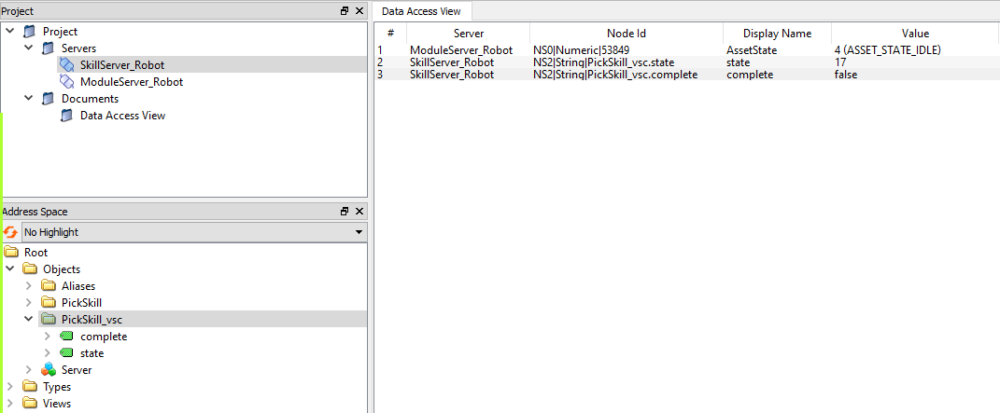
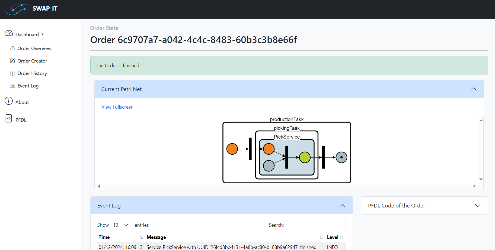
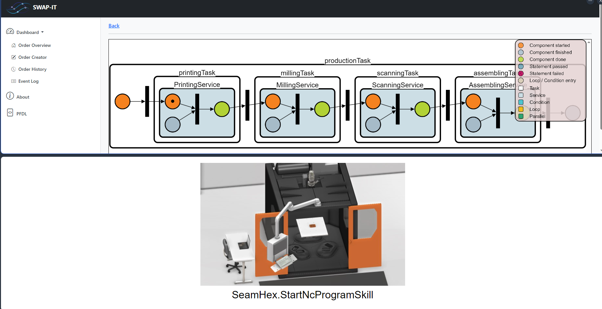

Advanced
########

At this point we have set up a skill server to serve skills and a module server to call these skills from a SWAP-IT compatible instance.
In the third tutorial, we will now implement the SWAP-IT software architecture and model a simple process in a PFDL file to demonstrate the basic procedure. We will then model the application scenario as described in :doc:`Introduction to Use Case <02_overview_introduction>`.

Set up of SWAP-IT software architecture
***************************************

The SWAP-IT software modules can all be started together with the following docker compose command:

.. code-block:: bash

    docker compose -f docker-compose-swap-it-architecture.yml -p advanced up -d

The invoked YAML file looks like this:

.. code-block:: YAML
    :linenos:

    services:

        Dashboard:
            image: ghcr.io/swap-it/cyberphysicalfactory/dashboard:latest 
            ports:
            - 8080:8080

        Assignment_Agent:
            image: ghcr.io/swap-it/cyberphysicalfactory/assignment-agent:latest
            ports:
            - 6000:6000

        Device_Registry:
            image: ghcr.io/swap-it/cyberphysicalfactory/device-registry:latest
            ports:
            - 8000:8000

        Execution_Engine:
            image: ghcr.io/swap-it/cyberphysicalfactory/execution-engine:latest
            ports:
            - 8081:8081
            - 3000:3000
            volumes:
                - "./pfdl:/app/pfdl"

.. list-table:: Explanation of code
   :widths: 10 70
   :header-rows: 1

   * - line number
     - meaning
   * - 3-6
     - `Dashboard <https://github.com/iml130/swap-it-dashboard>`_ is started at port 8080
   * - 8-11
     - `Assignment Agent <https://github.com/FraunhoferIOSB/swap-it-execution-engine>`_ is started at port 6000
   * - 13-16
     - `Device Registry <https://github.com/FraunhoferIOSB/swap-it-registry-module>`_ is started at port 8000
   * - 18-24
     - `Execution Engine <https://github.com/FraunhoferIOSB/swap-it-execution-engine>`_ is started at port 8081
   * - 23-24
     - the local folder *pfdl* is mounted to the container

All linked SWAP-IT software modules can manually be configured and set up by cloning and executing the Python code. For the sake of simplicity they are all provided for this tutorial as docker images.

The container list in *Docker Desktop* should look like follows at this point:

   *Docker Desktop* view for SWAP-IT container

The dashboard can be accessed in the browser at port 8080 of the localhost.

   *Dashboard* view in browser

So far there are no orders to be processed. In the next step, we will create and execute the first order.

Model simple process and execute the first order
************************************************

Before we model the first simple example process, we restart the skill server and module server from the last two tutorials. To do so, we execute the docker compose command from the last tutorial again:

.. code-block:: bash

    docker compose -f docker-compose-start-skill-and-module-server.yml -p advanced up -d

But since the device registry is running now we will first change the flag in line 8 of the Python module *robot.py* in the *modules* folder to *True*. Now the *Module_Server_Robot* will register with the device registry and make himself available to the *Assignment Agent*.

.. code-block:: python
    :linenos:

    import swapit_module_server
    from assets.RobotSkills import PickSkill

    def pick_service(x: float, y: float, z: float) -> bool:
        PickSkill(x, y, z)
        return True

    swapit_module_server.run("/opt/module-server/configs/robot.json", pick_service, True)

To model a process as a PFDL that only consists of the *PickService*, we can proceed as shown here:

.. code-block::
    :linenos:

    Struct PfdlBoolean
        value: boolean
    End 
    Struct PfdlNumber
        value: number
    End
    Struct PfdlString
        value: string
    End

    Struct PickParameters
        x: PfdlNumber
        y: PfdlNumber
        z: PfdlNumber
    End

    Task productionTask
        pickingTask
            In
                PickParameters
                {
                    "x" : {
                        "value": 1.1
                    },
                    "y" : {
                        "value": 0.5
                    },
                    "z" : {
                        "value": 1.3
                    }
                }
            Out
                succes: PfdlBoolean
    End
    
    Task pickingTask
        In
            pick_params: PickParameters
        PickService
            In
                pick_params.x
                pick_params.y
                pick_params.z
            Out
                success: PfdlBoolean
        Out
            success
    End

.. list-table:: Explanation of code
   :widths: 10 70
   :header-rows: 1

   * - line number
     - meaning
   * - 1-9
     - | definition of basic PFDL data types (this section of a PFDL file always has to be
       | included like this, if these data types are to be used)
   * - 11-15
     - | definition of service input parameters (they correspond to the input parameter 
       | definition in the module server configuration JSON file)
   * - 17-34
     - definition of *productionTask* with passing the input parameter for the *pickingTask*
   * - 36-48
     - definition of *pickingTask* (calls the robot's *PickService*)

Since in the *Execution Engine* docker container a `FastAPI Server <https://fastapi.tiangolo.com/>`_ is running we can execute any PFDL file now that was first stored in the *pfdl* folder and then mounted to the *Execution Engine* docker container by executing a *curl* command in the following way:

.. code-block:: bash

    curl -X POST "http://127.0.0.1:8081/execute_function/" -H "Content-Type: application/json" -d "{\"pfdl_filepath\": \"pfdl/simple_demo.pfdl\"}"

If we now take a look at the *Dashboard* again, we can see that a new order according to our PFDL file has been submitted and has already been executed (this can be determined by the fact that the black token is already in the *PickService*).

   *Dashboard* view with order state and Petri Net after executing the *simple_demo.pfdl*

A look at the module and skill server using the OPC UA client *UaExpert* reveals that both servers are in the *execute* state.

   *UaExpert* view on skill and module server after executing the *simple_demo.pfdl*

For now, we end the process by manually setting the boolean variable *complete* to *True* in the client with a mouse click. This transfers both servers to the *completed* state. The module server immediately goes back to the state (4) *idle* and is waiting for the next call.
   

   *UaExpert* view on skill and module server after terminating the process

In the *Dashboard* the token leaves the *PickService* and *The order is finished!* is reported:

   *Dashboard* view with order state and Petri Net after terminating the process

Model the application scenario process
**************************************

Now that the basic procedure of modeling a process with the PFDL and setting up the SWAP-IT architecture software modules has been demonstrated with an simple example, we will enter the next level and model the application scenario process.
The following YAML file combines all previous implementations in one file and starts all skill and module servers for the machines involved in the execution of the application scenario:

.. code-block:: YAML
    :linenos:

    services:

    Dashboard:
        image: ghcr.io/swap-it/cyberphysicalfactory/dashboard:latest 
        ports:
        - 8080:8080

    Assignment_Agent:
        image: ghcr.io/swap-it/cyberphysicalfactory/assignment-agent:latest
        ports:
        - 6000:6000

    Device_Registry:
        image: ghcr.io/swap-it/cyberphysicalfactory/device-registry:latest
        ports:
        - 8000:8000

    Execution_Engine:
        image: ghcr.io/swap-it/cyberphysicalfactory/execution-engine:latest
        ports:
        - 8081:8081
        - 3000:3000
        volumes:
            - "./pfdl:/app/pfdl"

    Module_Server_SeamHex:
        image: ghcr.io/swap-it/cyberphysicalfactory/module-server:latest
        ports:
            - 14841:14841
        volumes:
            - "./assets:/opt/assets"
            - "./modules:/opt/module-server"
        command: ["/opt/module-server/seamhex_service.py"]

    Module_Server_Maho:
        image: ghcr.io/swap-it/cyberphysicalfactory/module-server:latest
        ports:
            - 14842:14842
        volumes:
            - "./assets:/opt/assets"
            - "./modules:/opt/module-server"
        command: ["/opt/module-server/maho_service.py"]

    Module_Server_DMU:
        image: ghcr.io/swap-it/cyberphysicalfactory/module-server:latest
        ports:
            - 14843:14843
        volumes:
            - "./assets:/opt/assets"
            - "./modules:/opt/module-server"
        command: ["/opt/module-server/dmu_service.py"]

    Module_Server_Comau:
        image: ghcr.io/swap-it/cyberphysicalfactory/module-server:latest 
        ports:
            - 14844:14844
        volumes:
            - "./assets:/opt/assets"
            - "./modules:/opt/module-server"
        command: ["/opt/module-server/comau_service.py"]

    Module_Server_CMM:
        image: ghcr.io/swap-it/cyberphysicalfactory/module-server:latest
        ports:
            - 14845:14845
        volumes:
            - "./assets:/opt/assets"
            - "./modules:/opt/module-server"
        command: ["/opt/module-server/cmm_service.py"]

    Module_Server_BioiC:
        image: ghcr.io/swap-it/cyberphysicalfactory/module-server:latest
        ports:
            - 14846:14846
        volumes:
            - "./assets:/opt/assets"
            - "./modules:/opt/module-server"
        command: ["/opt/module-server/bioic_service.py"]

    Skill_Server_SeamHex:
        hostname: seamhex
        image: ghcr.io/swap-it/cyberphysicalfactory/skill-server:latest
        ports:
        - "4841:4840"
        volumes:
        - ./skills:/usr/skill_server/skills
        command: ["start_skill_server.py",--machine, SeamHex]

    Skill_Server_Maho:
        hostname: maho
        image: ghcr.io/swap-it/cyberphysicalfactory/skill-server:latest
        ports:
        - "4842:4840"
        volumes:
        - ./skills:/usr/skill_server/skills
        command: ["start_skill_server.py",--machine, Maho]

    Skill_Server_DMU:
        hostname: dmu
        image: ghcr.io/swap-it/cyberphysicalfactory/skill-server:latest
        ports:
        - "4843:4840"
        volumes:
        - ./skills:/usr/skill_server/skills
        command: ["start_skill_server.py",--machine, DMU]

    Skill_Server_Comau:
        hostname: comau
        image: ghcr.io/swap-it/cyberphysicalfactory/skill-server:latest
        ports:
        - "4844:4840"
        volumes:
        - ./skills:/usr/skill_server/skills
        command: ["start_skill_server.py",--machine, Comau]

    Skill_Server_CMM:
        hostname: cmm
        image: ghcr.io/swap-it/cyberphysicalfactory/skill-server:latest
        ports:
        - "4845:4840"
        volumes:
        - ./skills:/usr/skill_server/skills
        command: ["start_skill_server.py",--machine, CMM]

    Skill_Server_BioiC:
        hostname: bioic
        image: ghcr.io/swap-it/cyberphysicalfactory/skill-server:latest
        ports:
        - "4846:4840"
        volumes:
        - ./skills:/usr/skill_server/skills
        command: ["start_skill_server.py",--machine, BioiC]    

    Skill_Server_AGV:
        hostname: agv
        image: ghcr.io/swap-it/cyberphysicalfactory/skill-server:latest
        ports:
        - "4847:4840"
        volumes:
        - ./skills:/usr/skill_server/skills
        command: ["start_skill_server.py",--machine, AGV]

    Skill_Server_RoboOperator:
        hostname: robooperator
        image: ghcr.io/swap-it/cyberphysicalfactory/skill-server:latest
        ports:
        - "4848:4840"
        volumes:
        - ./skills:/usr/skill_server/skills
        command: ["start_skill_server.py",--machine, RoboOperator]

    Skill_Server_VisionRoboOperator:
        hostname: visionrobooperator
        image: ghcr.io/swap-it/cyberphysicalfactory/skill-server:latest
        ports:
        - "4849:4840"
        volumes:
        - ./skills:/usr/skill_server/skills
        command: ["start_skill_server.py",--machine, VisionRoboOperator]

    Skill_Server_VisionCMM:
        hostname: visioncmm
        image: ghcr.io/swap-it/cyberphysicalfactory/skill-server:latest
        ports:
        - "4850:4840"
        volumes:
        - ./skills:/usr/skill_server/skills
        command: ["start_skill_server.py",--machine, VisionCMM]

    Skill_Server_VisionBioiC:
        hostname: visionbioic
        image: ghcr.io/swap-it/cyberphysicalfactory/skill-server:latest
        ports:
        - "4851:4840"
        volumes:
        - ./skills:/usr/skill_server/skills
        command: ["start_skill_server.py",--machine, VisionBioiC]

.. list-table:: Explanation of code
   :widths: 10 70
   :header-rows: 1

   * - line number
     - meaning
   * - 3-24
     - definition of the SWAP-IT base modules
   * - 26-78
     - | definition of module servers for main machines (AGV and Vision modules do not have   
       | their own module servers, as their skills are implicitly called by the other module 
       | servers)
   * - 35-60
     - | for the *MillingService* three possible machines are provided to demonstrate how
       | a suitable asset is selected for a given service at runtime depending on given 
       | requirements for the specific process step
   * - 80-177
     - definition of skill servers (AGV and Vision skills are all called by other machines)

Again this YAML file can be executed by running the following command:

.. code-block:: bash

    docker compose -f docker-compose-application-scenario.yml -p advanced up -d

With the following *curl* command, the *cps_demo.pfdl* is started:

.. code-block:: bash

    curl -X POST "http://127.0.0.1:8081/execute_function/" -H "Content-Type: application/json" -d "{\"pfdl_filepath\": \"pfdl/cps_demo.pfdl\"}"

The *cps_demo.pfdl* looks like follows:

.. code-block:: python
    :linenos:

    Struct PfdlBoolean
        value: boolean
    End 
    Struct PfdlNumber
        value: number
    End
    Struct PfdlString
        value: string
    End

    # printing service
    Struct PrintingParameters
        part_id: PfdlString
        nc_program: PfdlString
    End
    Struct PrintingService_Capabilities
        printing_precision: string
    End
    # milling service
    Struct MillingParameters
        part_id: PfdlString
        nc_program: PfdlString
    End
    Struct MillingService_Capabilities
        milling_precision: string
    End
    # scanning service
    Struct ScanningParameters
        part_id: PfdlString
        nc_program: PfdlString
    End
    Struct ScanningService_Capabilities
        scanning_precision: string
    End
    # assembling service
    Struct AssemblingParameters
        part_id: PfdlString
        color: PfdlNumber
    End
    Struct AssemblingService_Capabilities
        robot_reach: string
    End

    Task productionTask
        printingTask
            In
                PrintingParameters
                {
                    "part_id" : {
                        "value": "1"
                    },
                    "nc_program" : {
                        "value": "C:\\data\\NC-Files\\Test_Skill.nc"
                    }
                }
                PrintingService_Capabilities
                {
                    "printing_precision": "1"
                }
            Out
                succes: PfdlBoolean
        millingTask
            In
                MillingParameters
                {
                    "part_id" : {
                        "value": "1"
                    },
                    "nc_program" : {
                        "value": "C:\\data\\Test.nc"
                    }
                }
                MillingService_Capabilities
                {
                    "milling_precision": "0.05"
                }
            Out
                success: PfdlBoolean
        scanningTask
            In
                ScanningParameters
                {
                    "part_id" : {
                        "value": "1"
                    },
                    "nc_program" : {
                        "value": "C:\\data\\Test.nc"
                    }
                }
                ScanningService_Capabilities
                {
                    "scanning_precision": "0.1"
                }
            Out
                success: PfdlBoolean
        assemblingTask
            In
                AssemblingParameters
                {
                    "part_id" : {
                        "value": "1"
                    },
                    "color" : {
                        "value": 1
                    }
                }
                AssemblingService_Capabilities
                {
                    "robot_reach": "1"
                }
            Out
                success: PfdlBoolean
    End
    
    Task printingTask
        In
            printing_params: PrintingParameters
            printing_capabilities: PrintingService_Capabilities
        PrintingService
            In
                printing_params.part_id
                printing_params.nc_program
                printing_capabilities
            Out
                success: PfdlBoolean
        Out
            success
    End
    
    Task millingTask
        In
            milling_params: MillingParameters
            milling_capabilities: MillingService_Capabilities
        MillingService
            In
                milling_params.part_id
                milling_params.nc_program
                milling_capabilities
            Out
                success: PfdlBoolean
        Out
            success
    End
    
    Task scanningTask
        In
            scanning_params: ScanningParameters
            scanning_capabilities: ScanningService_Capabilities
        ScanningService
            In
                scanning_params.part_id
                scanning_params.nc_program
                scanning_capabilities
            Out
                success: PfdlBoolean
        Out
            success
    End
    
    Task assemblingTask
        In
            assembling_params: AssemblingParameters
            assembling_capabilities: AssemblingService_Capabilities
        AssemblingService
            In
                assembling_params.part_id
                assembling_params.color
                assembling_capabilities
            Out
                success: PfdlBoolean
        Out
            success
    End

.. list-table:: Explanation of code
   :widths: 10 70
   :header-rows: 1

   * - line number
     - meaning
   * - 1-9
     - definition of basic PFDL data types
   * - 11-42
     - definition of service input parameters and asset capabilities
   * - 44-113
     - | definition of *productionTask* with passing the input parameters and the process step 
       | requirements for the sub tasks
   * - 115-173
     - definition of sub tasks

As it cannot be assumed that a licensed installation of Visual Components is available at this point, a different approach is chosen to emulate the connection to a simulation environment. The following command can be executed to start a docker container that terminates the called skills in an automated and illustrative way: 
 
.. code-block:: bash

    docker compose -f docker-compose-simulation-web-server.yml -p advanced up -d

The container also displays a corresponding image in the browser when a skill is called up and automatically terminates the skill after 5 seconds in order to continue to the next step. To do this, it is only necessary to click on the following link. Provided the container is running, a window then opens in the browser in which the images are displayed. 

`Image server <https://localhost:4000>`_

In a split screen view for the first service it looks like this:

   *Dashboard* view with petri net at the top and simulation web server at the bottom in split screen view

Demonstration of resource allocation at runtime
***********************************************

As promised in :doc:`Introduction to Use Case <02_overview_introduction>` at this point the assignment of services to specific assets at runtime will be demonstrated. 

The next table lists the assets that are suitable to execute the service of each process step.

.. list-table:: Overview of assets for the main services
   :widths: 25 25 25 25
   :header-rows: 1

   * - PrintingService
     - MillingService
     - ScanningService
     - AssemblingService
   * - SeamHex
     - Comau
     - CMM
     - BioiC
   * - 
     - RoboOperator / Maho
     - 
     - 
   * - 
     - DMU
     - 
     - 

It can be seen, that for the *MillingService* there are three possible assets, that can execute the service: Comau, RoboOperator with Maho, DMU

They are configured as follows with *costs* and *milling_precision*.

.. list-table:: Production *costs* and *milling_precision* of milling assets
   :widths: 25 25 25 25
   :header-rows: 1

   * - Property
     - Comau
     - RoboOperator/Maho
     - DMU
   * - costs
     - 10
     - 100
     - 1000
   * - milling_precision
     - 1
     - 0.1
     - 0.01

The *Assignment Agent* will choose the asset that fullfils the requirements of the PFDL:

.. code-block:: python
    :linenos:

    millingTask
    In
        MillingParameters
        {
            "part_id" : {
                "value": "1"
            },
            "nc_program" : {
                "value": "C:\\data\\Test.nc"
            }
        }
        MillingService_Capabilities
        {
            "milling_precision": "0.05"
        }
    Out
        success: PfdlBoolean

From all assets that fullfil the requirements, that one is chosen that has the minimal production *costs*.

Now you try it! Change the *milling_precision* parameter in the *cps_demo.pfdl* start the process execution and see what will happen! Enjoy!